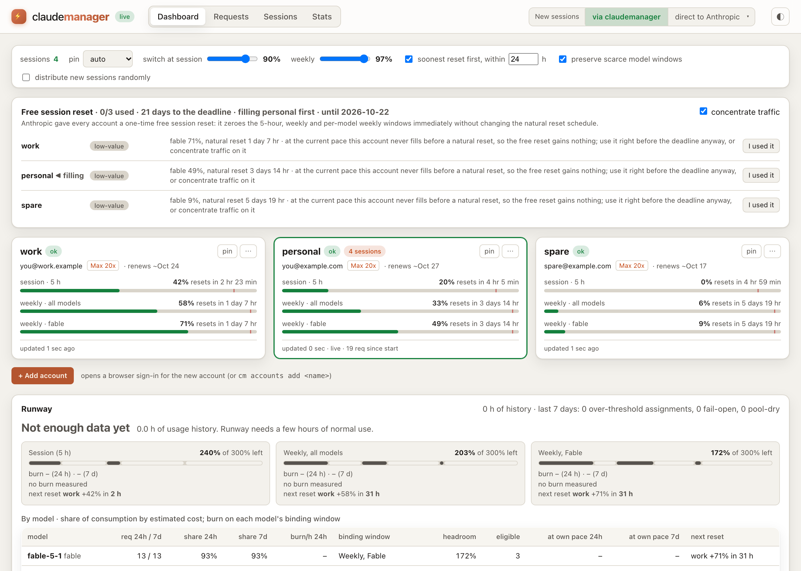

# claudemanager

**Run Claude Code across several Claude Max accounts as if they were one.** A small local proxy watches every
account's usage windows, routes each session to the account with the most room, and moves it before a limit
is hit, so sessions and unattended loops never stall. Comes with a terminal view, a web dashboard, and a
request log with tokens and cost.

> Not affiliated with Anthropic. This tool depends on Claude Code internals that are not publicly documented
> and may change; `cm doctor` checks each one. Whether using several subscriptions you own this way is fine
> under Anthropic's terms is your call.

```
claude (any session) --ANTHROPIC_BASE_URL--> cm daemon :4141 --swaps the auth token--> api.anthropic.com
                                                 |  reads the rate-limit headers on every response
cm status / cm watch / http://127.0.0.1:4141  <--+  polls each account's usage every few minutes
                                                 |  records prompts, responses, tokens (SQLite, local)
```

<picture>
  <source media="(prefers-color-scheme: dark)" srcset="docs/dashboard-dark.png">
  
</picture>

_The dashboard, from `cm demo` (synthetic accounts, no real login needed)._

## Requirements and platforms

- Node ≥ 22.13 (uses the built-in `node:sqlite`); Node 26 recommended.
- The `claude` CLI (Claude Code) installed and on `PATH`.
- Two or more Claude accounts with a Max subscription.
- **macOS**: credentials in the keychain, daemon kept alive by launchd.
  **Linux**: credentials in files (as Claude Code stores them), daemon kept alive by a systemd user unit.
  **Windows**: not supported yet.

## Install

```sh
npm install -g claudemanager
cm doctor
```

From source: `git clone … && npm install && npm link`. To look around without any Claude account: `cm demo`.

## Quick start

```sh
cm accounts add work        # opens a browser: sign in to the first account
cm accounts add personal    # …and the second (one login per account, each in its own config dir)
cm daemon install-service   # launchd / systemd user service: starts at login, restarts if it dies
cm route on                 # every new Claude Code session now goes through the proxy
cm status                   # or: cm watch, or open http://127.0.0.1:4141
```

The dashboard header has the same control: "via claudemanager", or a dropdown that sends new sessions straight to
Anthropic as any managed account with a long-lived token (`cm route off <account>` in the terminal). That works by
putting the account's long-lived token in `CLAUDE_CODE_OAUTH_TOKEN` in `~/.claude/settings.json`, which Claude Code
prefers over its stored login, so no login is copied or shared. Sessions already open keep their route until
restarted. Unattended loops that spawn
`claude` pick the proxy up on their next iteration. `cm route off` reverts; `cm run -- claude …` routes a
single command without touching settings.

To reuse the login you already have in `~/.claude` instead of signing in again:
`cm accounts add main --config-dir ~/.claude`. A dedicated login per account is cleaner.

### Optional: status line

`cm route on` also sets `cm statusline` as your Claude Code status line (skip with `--no-statusline`). It shows
this session's own account and windows, the pooled headroom for the model in use, and a hint when the advice is
to switch model or pause:

```
Fable 5.1 · ⚡ work · 5h 16% ↻2h44m · week 46% · fable 91% · pool: fable 84% across 2
```

### Optional: long-lived tokens

`claude setup-token` issues a roughly one-year token that needs no refresh. `cm accounts set-token <name>`
runs it and stores the token; the proxy then uses it for traffic and the normal login only for reading
usage. This removes the one way an account can drop out on its own (see Resilience).

## How routing works

Every `/v1/*` request is buffered, the model is read, and an account is chosen:

- **Sessions stick to an account.** Each Claude Code session (identified by its session-id header) is
  assigned an account and stays there, because its prompt cache lives with that account. It moves only when
  its account is no longer usable for the model it asked for, or for the guarded move below. New sessions
  land on the best account at that moment, so concurrent sessions spread out as accounts fill. Assignments
  survive daemon restarts.
- **Eligibility has tiers.** An account is preferred while its 5-hour window is under `threshold` (default
  90%) and its weekly and per-model weekly windows are under `weeklyThreshold` (default 97%). Over a
  threshold but under 100% it is still used when nothing better exists ("fallback"). At 100%, exhausted as
  reported by the server, disabled, or without a working token, it is never used. Thresholds are switching
  preferences, not limits: the proxy does not stall while any account has room.
- **Soonest reset first.** Among preferred accounts, the one whose relevant weekly window resets soonest is
  picked, so quota that is about to expire is spent before quota that keeps. Accounts with under 20% of their
  session window left rank last. Once every 30 minutes at most, a session may move to an account whose weekly
  window resets within `perishableHours` and still has 15% left. `preferSoonerReset: false` restores plain
  most-headroom ranking.
- **Model-aware allocation.** Models that only draw on the shared windows (Sonnet, Opus, Haiku) are sent to the
  accounts whose scarce per-model windows (Fable) are most spent, so Fable headroom survives on the accounts that
  still have it. Fable requests are unaffected. `modelAwareAllocation: false` turns it off.
- **Live numbers.** Rate-limit headers on every response update the serving account immediately; every
  account is polled every `pollIntervalSec`.
- **Genuine limit hits.** A 429 whose rate-limit headers say `rate_limited` marks the account exhausted until
  its reset and the request is retried on the next account. A 429 without those headers is a transient
  server-side throttle and passes through unchanged; Claude Code retries it.
- **Pinning.** `cm pin <name>` sends everything to one account while it is preferred; `cm unpin` returns to
  automatic routing.

Requests to non-inference paths (`/api/oauth/*`, `/v1/oauth/*`, …) pass through with the caller's own
credentials.

## Resilience

- **Fail open.** If no managed account is usable, requests are forwarded with the caller's own login instead
  of failing. These show as account `(passthrough)` in the log and as a `FAIL-OPEN` event.
- **Sleep-safe token refresh.** Claude's OAuth refresh tokens are single-use: if a refresh reaches the server
  but the response is lost (a laptop sleeping mid-request is enough), that login is dead until you sign in
  again. The daemon therefore never refreshes until the machine has been awake for 30 s, checks connectivity
  without credentials first, waits up to two minutes for a refresh response rather than aborting, serializes
  refreshes across accounts and holds all of them after any network failure, refreshes half an hour early
  while the old token still works, and keeps a refreshed token in memory if it cannot be persisted.
- **Recovery is one command.** `cm accounts login <name>`. `cm status`, the dashboard and `cm doctor` say
  which account needs it.
- **Nothing on the hot path.** Parsing, compression and database writes run in a worker thread; the proxy
  only swaps a header and streams bytes. `cm daemon status` shows per-request proxy overhead and event-loop
  lag.
- **The proxy comes up regardless of logging.** An unreadable database is moved aside and recreated; a
  crashed worker falls back to in-process recording.

## Scale

The proxy is one Node process: the request path is a header swap over a byte stream, and everything heavy runs in the
DB worker. Measured on an M-series Mac with `bench/load.mjs` (1,000 sessions, 300 KB bodies, 200 concurrent, a fake
upstream in the same process): ~1,300 requests/s, proxy overhead 0 ms at the median and 1 ms at p99, event-loop lag
p99 under 50 ms, and it runs inside a 512 MB heap. Things that keep it that way, all learned the hard way:

- A client that disconnects mid-stream aborts the upstream request immediately; nothing waits on a closed socket.
- The upstream pool holds up to `upstreamConnections` streams; a closed dashboard tab or a slow one never blocks
  state updates (frames are coalesced per client and skipped while its socket is backed up).
- Threshold crossings do not move every session at once: assigned sessions stay until `ejectThreshold`, moves are
  rate-limited by `maxMovesPerMinute`, and proactive moves happen at most once per 30 s across the pool.
- When the DB worker falls behind (`log.bodies: full` at hundreds of requests per second), new requests are recorded
  as metadata only until it drains; the daemon logs when that happens.
- The free-reset planner and other analysis never touch SQLite on the request path.

`node bench/load.mjs [sessions] [requestsPerSession] [bodyKB] [accounts] [concurrency]` reproduces the numbers.

## Observability

Every prompt and response through the proxy is stored in `~/.claudemanager/claudemanager.db`:

```sh
cm log                        # recent requests: account, model, session, tokens, cache, est. cost, latency
cm log -f --account work      # follow live
cm show 42                    # full system prompt, messages, tools, response, token breakdown
cm sessions                   # grouped by Claude Code session
cm stats --by model           # totals by account | model | day, optional --since <hours>
cm runway                     # will the pool run out before the next reset?
cm purge --before 2026-09-01  # delete old rows (--vacuum shrinks the file)
```

The dashboard has the same views (Dashboard with the runway panel, Requests, Sessions, Stats), and manages
accounts too: add one, rename, sign in again, set up a long-lived token, enable, disable or remove, all from the
account cards. Sign-in and token setup run the `claude` CLI on the daemon's side and open the browser; the card
shows progress and the sign-in link in case the browser did not open.

**Attribution** (Sessions tab, `cm attribution`) ranks sessions by their share of the pool's consumption in a
window, by estimated cost, and converts that share into weekly and 5-hour account-% actually measured on the
pool. **Context growth** (click a session, or `cm context <id>`) charts the prompt size per turn, marks turns
that re-wrote the prompt cache, lists the biggest jumps, and shows the largest tool results in the latest
prompt: the context length is what drives quota consumption.

**Runway** answers one question per window (session, weekly, each per-model weekly): will the pool run out
before the next reset adds headroom? It takes the pooled headroom across accounts, the burn rate measured from
usage snapshots over the last 24 hours and 7 days, and each account's real reset schedule, then walks forward:
headroom drains at the burn rate and jumps back at every reset. The dashboard also draws a 7-day reset
timeline per account. The verdict is deterministic: tight if any window empties before its next reset or the
pool ran dry or failed open this week, close if a session had to use an over-threshold account, otherwise
comfortable.

**Disk.** Each request repeats the whole conversation, so full logging grows by gigabytes per week of heavy
use. `log.bodies` = `full` | `lastTurn` (newest user message + response) | `none`. Rows older than
`log.retentionDays` are pruned hourly, and the oldest bodies are dropped when live data exceeds `log.maxDbMb`.
The file itself is never shrunk automatically (`cm purge --vacuum` does that).

## Promotions ("offers")

Anthropic occasionally grants something that changes what optimal routing looks like. The first is a **one-time
free session reset per account** (until 2026-10-22): it zeroes the account's 5-hour, weekly and per-model weekly
windows immediately but leaves the natural reset schedule alone. A reset is worth exactly the quota you would
otherwise have been blocked from using before the natural reset, so it is worth a full week when an account is
nearly full with days to go and nothing when the account resets naturally tomorrow.

Offers are **data, not code**: `offers.json` ships with the package, the daemon checks the same file in this
repository once a day so new promotions reach existing installs without an upgrade, and `offers.local` in the
config can add or override definitions. While an offer is active, the dashboard shows a panel and `cm offers`
prints, per account, the gain of using it now, the projected best moment before the deadline, and a
**RESET NOW** flag when the binding weekly window is at least `offers.minUtil` (85%) full with at least
`offers.minHoursBeforeNaturalReset` (48 h) to go. With `concentrate` on (the default), new sessions are routed to
one unused account at a time so it fills early and its reset is worth a full window; that account is marked ◀ in
the panel. When you use the reset in the Claude app, the daemon detects the drop and marks it used
(`cm offers used <name>` does it by hand). A `freereset.recommended` webhook and event fire when a row flips.
Plans are recomputed on every usage update (each poll and each proxied response) and every 5 minutes regardless,
so they track your actual pace. The panel disappears when the offer expires or every account has used it.

`cm offers list` shows every known definition; `cm offers disable <id>` hides one; `offers.feedUrl: null` stops
the daily fetch; `CLAUDEMANAGER_OFFERS=off` turns promotions off entirely. To propose a new offer definition,
open a pull request against `offers.json` (validated by `offers.schema.json`).

## For applications built on cm

Programs that drive Claude through the proxy (loops, agents, schedulers) can see the pool's state and react to it
without polling the dashboard.

**Response headers.** Every proxied `/v1/messages` response carries:

| Header                       | Example                                                                  | Meaning                                                               |
| ---------------------------- | ------------------------------------------------------------------------ | --------------------------------------------------------------------- |
| `x-cm-account`               | `work`                                                                   | account that served this request                                      |
| `x-cm-session-headroom`      | `62;reset=5400`                                                          | percent left on that account's 5-hour window; seconds until it resets |
| `x-cm-weekly-headroom`       | `41;reset=302000`                                                        | same for its weekly window                                            |
| `x-cm-model-headroom`        | `fable=12;reset=302000`                                                  | same for the requested model's weekly window                          |
| `x-cm-pool-session-headroom` | `380;reset=900`                                                          | pooled 5-hour headroom across accounts (account-%), next reset        |
| `x-cm-pool-model-headroom`   | `fable=110;accounts=2;reset=32000,opus=430;accounts=4;reset=0`           | pooled headroom per model family, accounts still eligible, next reset |
| `x-cm-advice`                | `continue` / `switch-model;to=opus` / `pause;until=2026-09-23T02:00:00Z` | what to do next                                                       |
| `x-cm-model-fallback`        | `claude-fable-5-1->claude-opus-5`                                        | present when the proxy rewrote the model (see below)                  |

**Query.** `GET /api/advice?session=<id>&model=<id>` returns the same information as JSON, plus reasons.
`cm advice [--session id] [--model id] [--json]` prints it.

**Wait and resume.** `GET /api/wait?model=<id>&min-headroom=15&timeout=600` long-polls until the pooled
headroom for that model family reaches the target (or the session pool, when no model is given). `cm wait
--model fable --min-headroom 15` wraps it and exits 0 when satisfied, 2 on timeout, so a loop can be
`cm wait --model fable && claude -p …`.

**Webhooks.** `cm webhooks add <url> [--events limit.*,pool.dry] [--secret s]` registers an endpoint. Events are
JSON POSTs `{id, event, at, data}` with `x-cm-event`, `x-cm-delivery` and, when a secret is set,
`x-cm-signature: sha256=<hmac of the body>`; delivery is retried three times with backoff. Events:
`limit.reset` (an account's window reset: account, window, freed), `limit.approaching` and `limit.exhausted`
(pooled headroom for a model family fell below `advice.approachingHeadroom`, or to zero), `limit.recovered`,
`pool.dry`, `routing.switch`, `routing.fallback`, `model.fallback`, `account.needs_login`. The same events
appear on the SSE stream at `/api/events`. `cm webhooks test <url>` sends a signed `ping`.

**Model fallback (off by default).** `cm config set modelFallback.fable claude-opus-5` makes the proxy rewrite the
model when the requested family has no pooled headroom left (`modelFallbackHeadroom`, default 0, raises that
bar). This is the one place the proxy edits a request body. Every such request is logged with the model that was
asked for, marked in `cm log` and the dashboard, announced as a `model.fallback` event, and flagged in the
`x-cm-model-fallback` header.

## Configuration

`~/.claudemanager/config.json`, edited with `cm config get|set <key> <value>` (dotted keys work). The
dashboard header exposes the policy knobs. `CLAUDEMANAGER_HOME` moves the whole directory; `NO_COLOR`
disables terminal colours; `CLAUDEMANAGER_OFFERS=off` disables promotions.

| Key                                             | Default                     | Meaning                                                                                                                               |
| ----------------------------------------------- | --------------------------- | ------------------------------------------------------------------------------------------------------------------------------------- |
| `port`                                          | 4141                        | daemon port. After changing it: `cm daemon restart`, then `cm route on` again                                                         |
| `threshold`                                     | 90                          | switch away when an account's 5-hour window reaches this percent (50–100)                                                             |
| `weeklyThreshold`                               | 97                          | same for the weekly and per-model weekly windows                                                                                      |
| `preferSoonerReset`                             | true                        | rank preferred accounts by soonest weekly reset                                                                                       |
| `ejectThreshold`                                | threshold + 10              | an assigned session is moved off its account only when its 5-hour window reaches this; new sessions stop landing there at `threshold` |
| `maxMovesPerMinute`                             | 10                          | budget for threshold-driven session moves per minute (plus 2% of active sessions); exhaustion and auth moves are exempt               |
| `upstreamConnections`                           | 1024                        | concurrent upstream streams the proxy may hold open                                                                                   |
| `distribute`                                    | false                       | assign each new session to a random eligible account instead of the ranked first; sessions still stick afterwards                     |
| `modelAwareAllocation`                          | true                        | route shared-window models to accounts whose per-model (Fable) windows are most spent                                                 |
| `perishableHours`                               | 24                          | proactively move to an account whose weekly window resets within this many hours (0 disables)                                         |
| `pinned`                                        | null                        | account name that receives all traffic while it is preferred                                                                          |
| `pollIntervalSec`                               | 150                         | usage poll cadence per account (the usage endpoint rate-limits faster polling)                                                        |
| `activePollIntervalSec`                         | 150                         | cadence for the account serving the most recent request                                                                               |
| `upstream`                                      | `https://api.anthropic.com` | where requests are forwarded                                                                                                          |
| `retryOn429`                                    | true                        | retry a genuine limit hit once on the next account                                                                                    |
| `maxBodyBytes`                                  | 33554432                    | largest request body the proxy buffers                                                                                                |
| `log.bodies`                                    | `full`                      | `full` \| `lastTurn` \| `none`                                                                                                        |
| `log.retentionDays`                             | 30                          | prune rows older than this                                                                                                            |
| `log.maxDbMb`                                   | 2048                        | drop the oldest bodies above this much live data                                                                                      |
| `advice.approachingHeadroom`                    | 15                          | pooled account-% below which a model family is "almost gone" (advice, `limit.approaching`)                                            |
| `modelFallback`                                 | `{}`                        | family → model to rewrite to when that family's pooled headroom is gone, e.g. `{"fable": "claude-opus-5"}`                            |
| `modelFallbackHeadroom`                         | 0                           | pooled account-% at or below which the fallback applies                                                                               |
| `webhooks`                                      | `[]`                        | `[{url, events, secret}]`, managed with `cm webhooks`                                                                                 |
| `offers.feedUrl`                                | this repo's `offers.json`   | daily feed of promotion definitions; `null` disables the fetch                                                                        |
| `offers.local` / `offers.disabled`              | `[]`                        | extra or overriding definitions / ids to ignore                                                                                       |
| `offers.concentrate`                            | true                        | fill one unused account at a time for free-reset offers                                                                               |
| `offers.minUtil` / `minHoursBeforeNaturalReset` | 85 / 48                     | when to say RESET NOW                                                                                                                 |
| `prices`                                        | see config                  | USD per million tokens by model family, for cost estimates. Update when Anthropic's pricing changes                                   |

## CLI

| Command                                                                                                                       | What it does                                                                                                                                                   |
| ----------------------------------------------------------------------------------------------------------------------------- | -------------------------------------------------------------------------------------------------------------------------------------------------------------- |
| `cm status [--json] [--direct]`                                                                                               | every account's windows and reset times; `--direct` polls without the daemon                                                                                   |
| `cm watch`                                                                                                                    | live status                                                                                                                                                    |
| `cm accounts add <name> [--config-dir <dir>] [--email <e>] [--force]`                                                         | sign an account in and register it                                                                                                                             |
| `cm accounts login <name>`                                                                                                    | sign in again after a dead login (also re-enables)                                                                                                             |
| `cm accounts set-token <name> [--no-run]` / `clear-token <name>`                                                              | store / remove a long-lived token                                                                                                                              |
| `cm accounts rename <name> <new>`                                                                                             | rename an account's alias (login and tokens stay)                                                                                                              |
| `cm accounts list` / `remove <name>` / `enable <name>` / `disable <name>` / `refresh`                                         | manage the roster                                                                                                                                              |
| `cm pin <name>` / `cm unpin`                                                                                                  | force one account / back to automatic                                                                                                                          |
| `cm route on [--no-statusline] [--force]` / `off [account\|stock]` / `status`                                                 | native routing via `~/.claude/settings.json` (always backed up, written atomically); `off <account>` makes direct sessions use that account's long-lived token |
| `cm run -- <command>` / `cm env`                                                                                              | route one command / print the export for a shell                                                                                                               |
| `cm daemon start` / `stop` / `restart` / `run` / `status` / `logs [-n N]`                                                     | daemon lifecycle (`run` = foreground)                                                                                                                          |
| `cm daemon install-service` / `uninstall-service`                                                                             | launchd (macOS) or systemd user (Linux) service                                                                                                                |
| `cm config get [key]` / `set <key> <value>` / `path`                                                                          | configuration                                                                                                                                                  |
| `cm log [--account] [--model] [--session] [--q text] [-n N] [--json] [-f]`                                                    | request log                                                                                                                                                    |
| `cm show <id> [--json]` / `cm sessions [-n N]` / `cm stats [--by account\|model\|day] [--since hours]`                        | details                                                                                                                                                        |
| `cm runway [--json]`                                                                                                          | pooled headroom, burn rate, time-to-empty and reset schedule per window and per model                                                                          |
| `cm attribution [--hours N]`                                                                                                  | which sessions consumed the pool's quota                                                                                                                       |
| `cm context <session>`                                                                                                        | a session's context growth turn by turn and its largest tool results                                                                                           |
| `cm offers [plan]` / `list` / `refresh` / `enable\|disable <id>` / `concentrate on\|off` / `used\|unused <name> [--offer id]` | promotions and the free-reset planner                                                                                                                          |
| `cm demo [--port N]`                                                                                                          | self-contained demo with synthetic accounts and traffic; touches nothing of yours                                                                              |
| `cm advice [--session id] [--model id] [--json]`                                                                              | what a session should do next, with pooled headroom per model                                                                                                  |
| `cm wait [--model id] [--min-headroom n] [--timeout s]`                                                                       | block until the pool has headroom (exit 0) or time out (exit 2)                                                                                                |
| `cm webhooks list` / `add <url> [--events] [--secret]` / `remove <url>` / `test <url>`                                        | event delivery to HTTP endpoints                                                                                                                               |
| `cm purge [--before date] [--vacuum]`                                                                                         | delete logged requests                                                                                                                                         |
| `cm statusline`                                                                                                               | Claude Code status-line command                                                                                                                                |
| `cm web`                                                                                                                      | open the dashboard                                                                                                                                             |
| `cm doctor`                                                                                                                   | check every assumption about Claude Code internals and the local setup                                                                                         |

## Security and privacy

Everything runs on your machine. The control API and dashboard bind to `127.0.0.1` without authentication;
they reject requests whose `Host`/`Origin` are not the daemon's own, which stops other websites and DNS
rebinding, but any local process can read the request log through them. Prompts and responses are stored in
plaintext SQLite (mode 0600); use `log.bodies none` if that is not acceptable. Logins live where Claude Code
puts its own. See `SECURITY.md`.

## Undocumented internals

Everything this tool knows about Claude Code that Anthropic has not published lives in one file,
`src/core/claude-internals.ts`, with the version it was verified against: how credentials are stored, the
OAuth refresh endpoint, the usage endpoint and its per-model `limits[]`, the `anthropic-ratelimit-unified-*`
response headers, and the session-id header. After a Claude Code update, run `cm doctor`; it exercises each
assumption and names the one that broke.

A custom `ANTHROPIC_BASE_URL` makes Claude Code skip a couple of organization-policy lookups. Switching an
account mid-conversation re-writes that session's prompt cache once; affinity keeps that rare.

## Development

```sh
npm install        # builds dist/
npm test           # node --test against a fake upstream; no network, keychain or real config touched
npm run lint
npm run dev:daemon
```

See `CONTRIBUTING.md` and `CLAUDE.md` (layout, incident-derived rules, conventions).

## License

MIT
